# AFv2 Pattern #1: Chaining

Sequential chaining pattern with Human-in-the-Loop approval gate (4-agent example).

This pattern supports 2 to N agents - customize the chain length based on your workflow requirements.

## Pattern Structure

```
Start → Chain1 → HIL Gate → Chain2 → Chain3 → Report → Direct Reply
```

### Visual Flow Diagram

```mermaid
graph LR
    A[🎬 Start] --> B[🔍 Chain1<br/>Initial Analysis]
    B --> C{👤 HIL Gate<br/>Approval Required}
    C -->|✅ Approve| D[✏️ Chain2<br/>Write Operations]
    C -->|❌ Reject| X[⛔ Workflow Terminated]
    D --> E[🔄 Chain3<br/>Final Processing]
    E --> F[📊 Report<br/>Summary Generation]
    F --> G[💬 Direct Reply]

    style A fill:#7EE787,stroke:#2EA043,stroke-width:2px
    style B fill:#4DD0E1,stroke:#0097A7,stroke-width:2px
    style C fill:#FF6B6B,stroke:#D32F2F,stroke-width:2px
    style D fill:#4DD0E1,stroke:#0097A7,stroke-width:2px
    style E fill:#4DD0E1,stroke:#0097A7,stroke-width:2px
    style F fill:#66BB6A,stroke:#2EA043,stroke-width:2px
    style G fill:#FFD700,stroke:#FFA000,stroke-width:2px
    style X fill:#999,stroke:#666,stroke-width:2px
```



**Color Legend:**
- 🟢 Green: Start/Report nodes
- 🔵 Cyan: Agent nodes (Chain1, Chain2, Chain3)
- 🔴 Red: Human-in-the-Loop gate
- 🟡 Yellow: Direct Reply (terminal)

### State Evolution Diagram


This diagram shows how **state accumulates** through the chain - each agent reads previous artifacts and adds new ones without overwriting.

## Key Features

- 4 specialized agents (Chain1, Chain2, Chain3, Report)
- Human-in-the-Loop approval gate before write-capable tools
- Sequential artifact handoffs via Flow State
- Direct Reply terminal node

## Files

- `01-chaining.json` - Complete Flowise workflow (1058 lines)
- `TESTING.md` - Comprehensive test cases

## Quick Start

1. Import `01-chaining.json` into Flowise
2. Configure Anthropic API key for all agents
3. Test with sample input

## Use Cases

- Document processing pipelines (OCR → Extract → Transform)
- Data transformation workflows (Raw → Clean → Enrich)
- Sequential approval workflows

## Why This Pattern?

The chaining pattern is essential when:

- **Dependencies exist**: Step B requires output from Step A (can't process payment before approval)
- **Governance required**: Human approval checkpoints between automated stages
- **Audit trails needed**: Each stage produces versioned artifacts for compliance
- **Progressive refinement**: Each stage adds value to previous output (draft → revision → final)

### When to Use Chaining

| Scenario | Why Chaining Works |
|----------|-------------------|
| **Approval workflows** | Sequential gates prevent unauthorized actions |
| **Document processing** | Extract → Validate → Process → Archive (dependencies) |
| **Data pipelines** | ETL operations (extract depends on load) |
| **Compliance flows** | Audit trail required, each step builds on previous |
| **Customer journeys** | Onboarding steps have strict dependencies |

### When NOT to Use Chaining

| Use This Instead | When |
|------------------|------|
| **Pattern #2 (Parallel)** | Independent tasks (web search + KB search + analysis can run concurrently) |
| **Pattern #3 (Routing)** | Conditional paths (route to different departments based on input) |
| **Pattern #4 (Iteration)** | Quality refinement loops (improve until score > 0.9) |
| **Pattern #5 (Looping)** | Batch processing (process array of 100 items) |

---

## Architecture Deep-Dive

### Node Responsibilities

| Node | Type | Input | Output | State Updates | Tools |
|------|------|-------|--------|---------------|-------|
| **Start** | `startAgentflow` | User query | Raw input | None | None |
| **Chain1** | `agentAgentflow` | Raw input | artifact_1 | `artifacts.artifact_1`<br/>`chain.step=1` | `currentDateTime` |
| **HIL Gate** | `humanInputAgentflow` | artifact_1 | Approval decision | None | None |
| **Chain2** | `agentAgentflow` | artifact_1 | artifact_2 | `artifacts.artifact_2`<br/>`chain.step=2` | `currentDateTime`<br/>`calculator` |
| **Chain3** | `agentAgentflow` | artifact_2 | final_draft | `artifacts.final_draft`<br/>`chain.step=3`<br/>`output` | `currentDateTime` |
| **Report** | `agentAgentflow` | All artifacts | Execution report | `report.generated`<br/>`report.timestamp` | `currentDateTime` |
| **Direct Reply** | `directReplyAgentflow` | Report output | User message | None | None |

### Why 4 Agents?

This example uses 4 agents to demonstrate:

1. **Chain1**: Initial extraction/analysis (read-only operations, safe)
2. **Chain2**: Write operations (after human approval, uses calculator tool)
3. **Chain3**: Final validation/cleanup (read-only, ensures quality)
4. **Report**: Structured output generation (formats results for user)

**Key Design Principle**: The Human-in-the-Loop gate is positioned **before Chain2** because Chain2 has write-capable tools. This prevents automated write operations on unvalidated data.

**You can use 2, 3, 5, 10+ agents** depending on your workflow complexity. See [EXAMPLES.md](./EXAMPLES.md) for scaling variants.

---

## Real-World Examples

### Example 1: Invoice Processing (4-stage)

**Use Case**: Finance team processes vendor invoices with approval workflow

```
Start → Extract Data → [HIL: Finance Manager Approval] → Process Payment → Send Confirmation → Report
```

**Agent Breakdown**:
- **Chain1**: OCR + data extraction from PDF invoice (vendor, amount, line items)
- **HIL Gate**: Finance manager reviews extracted data, approves amount and vendor
- **Chain2**: Initiates payment in ERP system, updates accounting records
- **Chain3**: Sends confirmation email to vendor, generates receipt
- **Report**: Creates audit log entry with approval records

**Why Chaining**: Payment cannot happen before approval. Confirmation requires payment success. Sequential dependencies are unavoidable.

**Expected Execution**:
- Chain1: 5s (OCR processing)
- HIL Gate: Variable (human approval time)
- Chain2: 8s (ERP API calls)
- Chain3: 3s (email send)
- Total: ~16s + approval time

---

### Example 2: Customer Onboarding (7-stage)

**Use Case**: Bank onboards new customers with compliance requirements

```
Start → Identity Verify → Risk Score → [HIL: Compliance Officer Review] → Create Account → Welcome Email → Email Verification → Compliance Audit → Report
```

**Agent Breakdown**:
- **Chain1**: Verify ID documents using third-party API
- **Chain2**: Calculate risk score based on verification results
- **HIL Gate**: Compliance officer reviews high-risk customers (score > 7)
- **Chain3**: Create customer account in CRM
- **Chain4**: Generate and send welcome package
- **Chain5**: Track email verification status
- **Chain6**: Generate compliance audit trail
- **Report**: Summary of onboarding process with timestamps

**Why Chaining**: Account creation requires compliance approval. Welcome email requires account creation. Email verification requires welcome email sent. Clear sequential dependencies.

---

### Example 3: Content Publishing (2-stage minimal)

**Use Case**: Editorial workflow for blog posts

```
Start → Draft Content → [HIL: Editor Approval] → Publish to CMS → Report
```

**Agent Breakdown**:
- **Chain1**: AI drafts blog post based on topic and keywords
- **HIL Gate**: Editor reviews draft, approves or rejects
- **Chain2**: Publishes approved content to WordPress via API
- **Report**: Publication metrics (URL, publish time, tags)

**Why Chaining**: Publishing requires editorial approval. Simple 2-agent chain demonstrates minimum viable chaining pattern.

---

## Customization Guide

### Adding More Agents (Scale to 5, 7, 10+)

To extend the chain from 4 to 5 agents:

1. **Add new agent node** in JSON after Chain3:
```json
{
  "id": "agent_chain_4",
  "type": "agentAgentflow",
  "position": { "x": 800, "y": 200 },
  "data": {
    "label": "Agent.Chain4",
    "inputs": {
      "agentStateUpdates": [
        { "key": "artifacts.artifact_4", "value": "{{ artifact_4 }}" },
        { "key": "chain.step", "value": "4" }
      ]
    }
  }
}
```

2. **Add edge** from Chain3 to Chain4:
```json
{
  "source": "agent_chain_3",
  "target": "agent_chain_4",
  "type": "buttonedge"
}
```

3. **Update Report agent** to read `artifacts.artifact_4` from state

### Removing Agents (Simplify to 2-stage)

To reduce from 4 to 2 agents:

1. **Delete** Chain2 and Chain3 nodes from JSON
2. **Connect Chain1 directly to Report**:
```json
{
  "source": "agent_chain_1",
  "target": "agent_report",
  "type": "buttonedge"
}
```
3. **Update Report** to only reference `artifacts.artifact_1`
4. **Optional**: Remove HIL gate if no approval needed

### Moving HIL Gate Position

**Current**: HIL gate between Chain1 and Chain2

**Alternative 1**: HIL gate between Chain2 and Chain3
- Use when write operations in Chain2 are safe, but final deployment (Chain3) needs approval

**Alternative 2**: Multiple HIL gates
- Add HIL gate after Chain1 (data validation approval)
- Add HIL gate after Chain3 (final deployment approval)
- Two checkpoints for extra governance

---

## Performance Considerations

### Execution Time (Average)

| Stage | Duration | Notes |
|-------|----------|-------|
| Chain1 | 3-5 seconds | Read-only operations (analysis/extraction) |
| HIL Gate | Variable | Human approval time (seconds to hours) |
| Chain2 | 4-6 seconds | Write operations (API calls, database updates) |
| Chain3 | 3-5 seconds | Final processing/validation |
| Report | 2-3 seconds | Structured output generation |
| **Total** | **12-19 seconds** | Excluding human approval time |

### Token Usage (Approximate)

| Agent | Input Tokens | Output Tokens | Cost (Sonnet 4.5) |
|-------|--------------|---------------|-------------------|
| Chain1 | 500-800 | 200-400 | $0.004-$0.008 |
| Chain2 | 800-1200 | 300-500 | $0.007-$0.012 |
| Chain3 | 1200-1500 | 400-600 | $0.010-$0.015 |
| Report | 1500-2000 | 500-800 | $0.013-$0.020 |
| **Total** | **4000-5500** | **1400-2300** | **$0.034-$0.055** |

*Based on Claude Sonnet 4.5 pricing: $3 per 1M input tokens, $15 per 1M output tokens*

### Cost Optimization Tips

1. **Use smaller models for simple stages**:
   - Chain1: Haiku ($0.25/$1.25 per 1M) → 75% cost reduction
   - Report: Haiku → 70% cost reduction
   - Keep Sonnet 4.5 for Chain2/Chain3 (complex logic)

2. **Reduce state bloat**:
   - Don't re-read entire state history at each stage
   - Chain2 only needs `artifact_1`, not full conversation history

3. **Batch processing**:
   - Process multiple items in parallel workflow instances
   - Better throughput than sequential item-by-item

---

## Troubleshooting

### Issue: Agents Not Seeing Previous Artifacts

**Symptom**: Chain2 reports "cannot find artifact_1" or processes without context

**Cause**: `agentEnableMemory` not set to `true` in agent configuration

**Solution**:
1. Click Chain2 agent node in Flowise UI
2. Find "Enable Memory" toggle
3. Set to `true`
4. Save workflow
5. Repeat for Chain3 and Report agents

---

### Issue: HIL Gate Not Showing Approval Prompt

**Symptom**: Workflow stops at Chain1, no approval dialog appears

**Cause**: State variable reference incorrect in HIL gate description

**Solution**:
1. Click HIL gate node
2. Check "Description" field includes: `{{ artifacts.artifact_1 }}`
3. Verify Chain1 updates state with key: `artifacts.artifact_1`
4. Test workflow again

---

### Issue: Report Shows Incomplete Artifact Lineage

**Symptom**: Report only shows `final_draft`, missing `artifact_1` and `artifact_2`

**Cause**: State variables overwritten instead of accumulated

**Solution**:
- Each agent must ADD new keys, not overwrite existing ones
- Chain1: Set `artifacts.artifact_1` (don't touch `artifact_2`/`final_draft`)
- Chain2: Set `artifacts.artifact_2` (don't touch `artifact_1`/`final_draft`)
- Chain3: Set `artifacts.final_draft` (don't touch `artifact_1`/`artifact_2`)

**Verification**: Check state after each agent execution - all previous keys should still exist.

---

## Related Patterns

- **[Pattern #2 (Parallel)](https://github.com/snedea/afv2-pattern-02-parallel)**: Run independent agents concurrently
- **[Pattern #3 (Routing)](https://github.com/snedea/afv2-pattern-03-routing)**: Conditional path selection
- **[Pattern #4 (Iteration)](https://github.com/snedea/afv2-pattern-04-iteration)**: Quality-driven refinement loops
- **[Pattern #10 (RAG)](https://github.com/snedea/afv2-pattern-10-rag)**: Knowledge-base grounded generation

---

## Additional Documentation

- **[TESTING.md](./TESTING.md)** - Comprehensive test cases with validation checklists
- **[INTEGRATION_GUIDE.md](./INTEGRATION_GUIDE.md)** - Step-by-step import and configuration
- **[EXAMPLES.md](./EXAMPLES.md)** - Scaling variants (2, 5, 7-agent examples)
- **[Pattern Library](https://github.com/snedea/afv2-patterns-index)** - All 13 patterns

---

🤖 Built with Context Foundry

